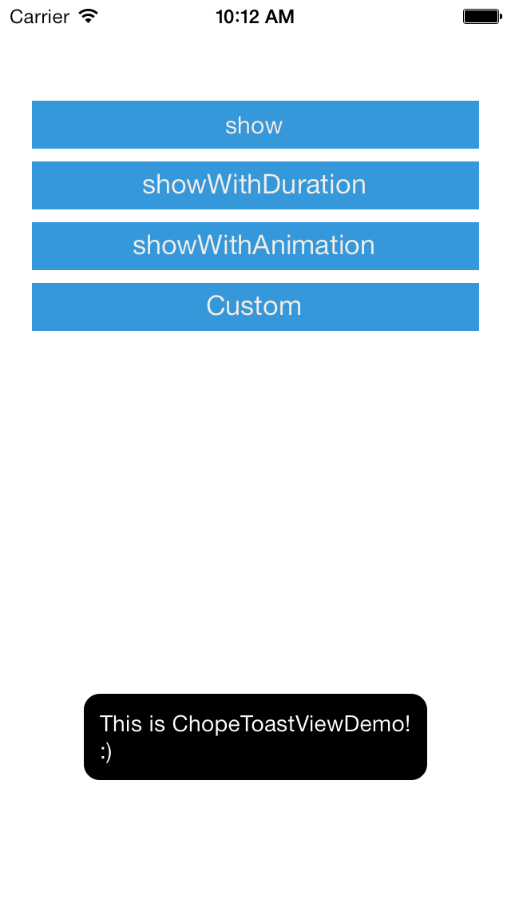
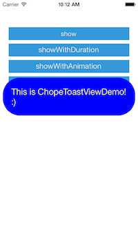

ChopeToastView
==============

iOS toast view


## Getting Started

#### CocoaPods

```ruby
platform :ios
pod "ChopeToastView"
```

## Usage

```objective-c
[[ChopeToastView ToastViewWithMessage:@"message"] show];
```

## Appearance
* UIFont *font
* UIColor *textColor
* UIEdgeInsets padding
* UIEdgeInsets margin
* CGFloat roundRadius
* NSTextAlignment textAlignment
* UIColor *backgroundColor

## Screenshot

### Default

> 

### Custom

> 

## License

ChopeToastView is available under the MIT license. See the LICENSE file for more info.
